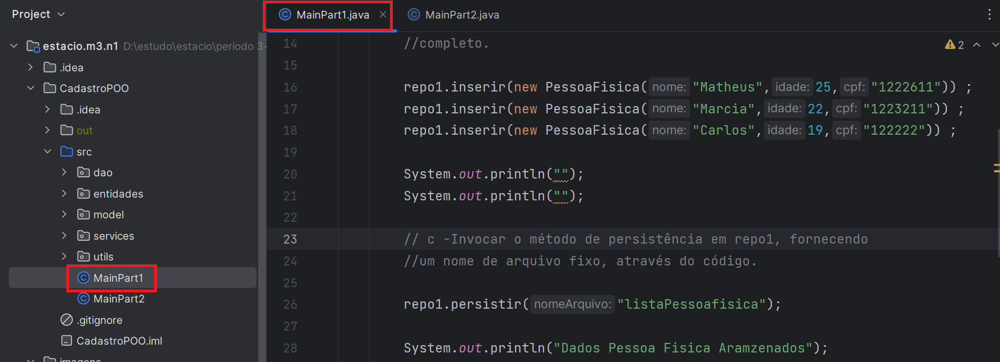
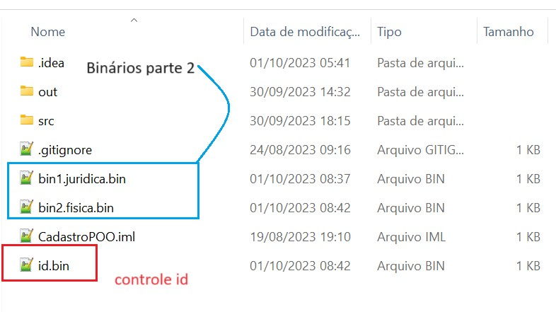
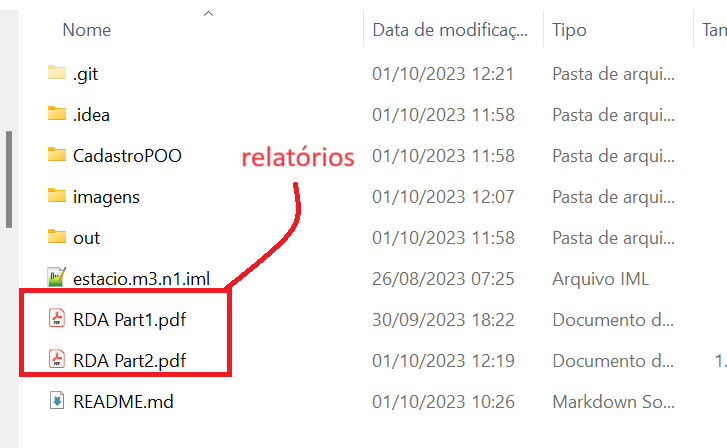
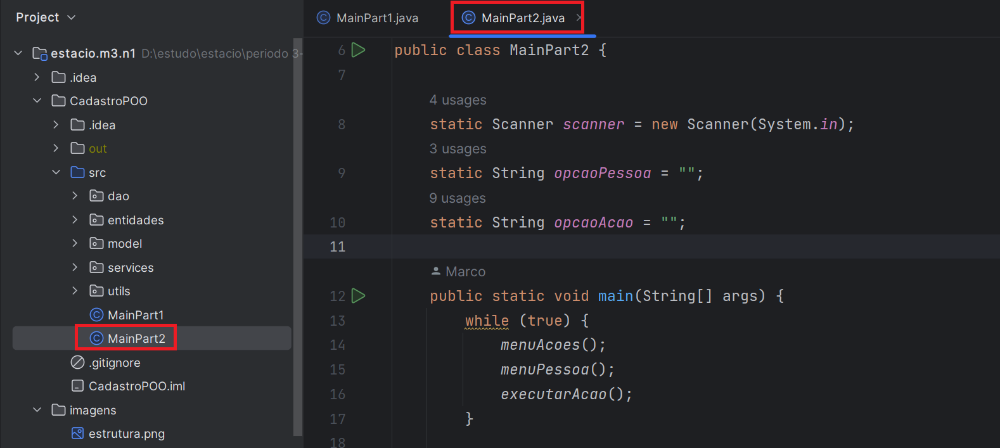

## Estacio| Missão Prática | Nível 1 | Mundo 3

## Descrição

Implementação de um app Java Application para cadastro de clientes em modo texto, com persistência em arquivos, baseado na tecnologia Java.

### Objetivos da prática

  - Utilizar herança e polimorfismo na  definição de entidades.
  - Utilizar persistência de objetos em arquivos binários.
  - Implementar uma interface cadastral em modo texto.
  - Utilizar o controle de exceções da plataforma Java.
  - No final do projeto, o aluno terá implementado um sistema cadastral em Java, utilizando os recursos da 
    programação orientada a objetos e a persistência em arquivos binários.
    

### Procedimentos

- Os procedimentos são divididos em duas etapas

  - 1º Procedimento | Criação das Entidades e Sistema de Persistência
    -   Definição das entidades PessoaFisica e Juridica
    -   Definição dos gerenciadores ou classes Repo 
    -   Utilizar as classes Repo na execução de um CRUD
    -   Gerar Relatório discente de acompanhamento (RDA Part1.pdf)
    -   Executar MainPart1.java

  - Execução do código
    - Executar o arquivo MainPart1.java para obter os resultados de execução dos codigos definidos em RDA Part1.pdf
    - 
    

   
 -  2º Procedimento | Criação do Cadastro em Modo Texto    
    -   Definição do menu e arquivos binarios
    -   Definição do procedimento de validação
    -   Utilizar o menu execução de um CRUD
    -   Gerar Relatório discente de acompanhamento (RDA Part2.pdf)
    -   Executar MainPart2.java
    
    obs: a geração dos ids unicos é feita através de codigo e os relatórios se encontram na pasta do projeto

    

    

  - Execução do código
    - Executar o arquivo MainPart2.java para obter os resultados de execução dos codigos definidos em RDA Part2.pdf

   

    
 
     ## Especificação
     https://sway.office.com/s/rCYHGUtt44OGcxgB/embed
    
    

    

